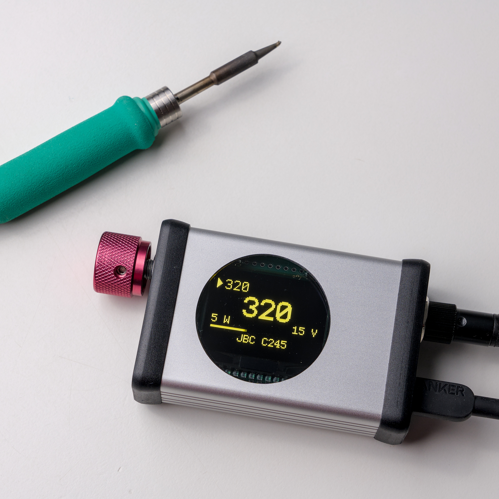
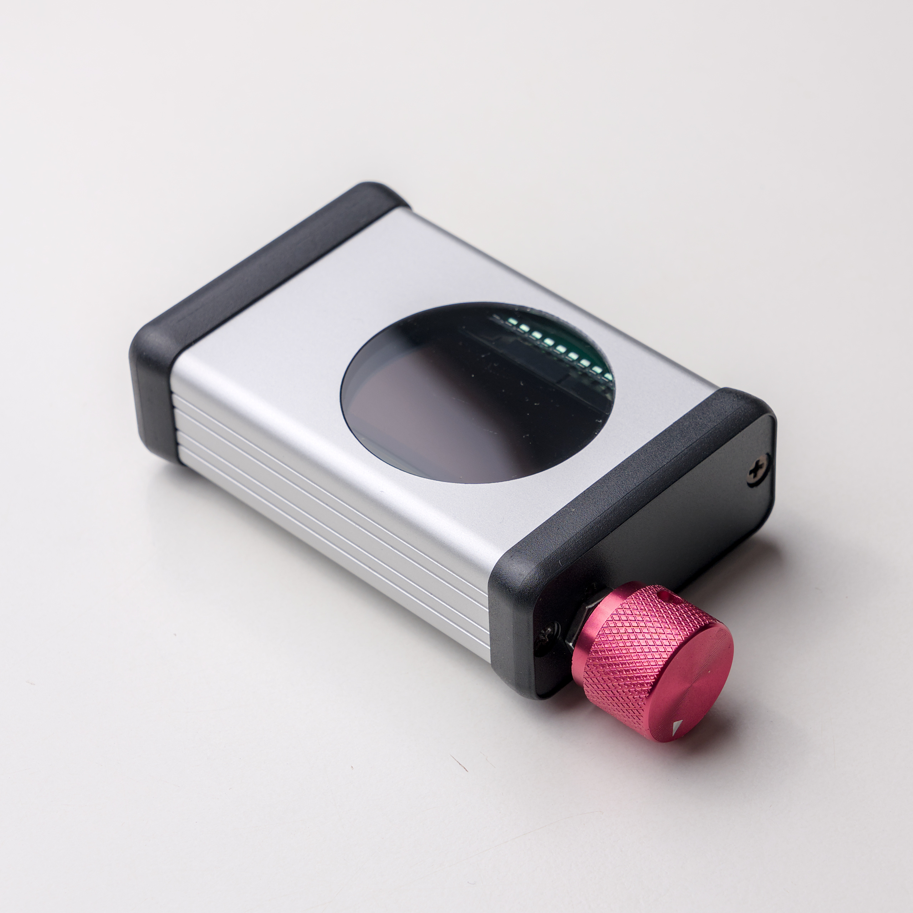
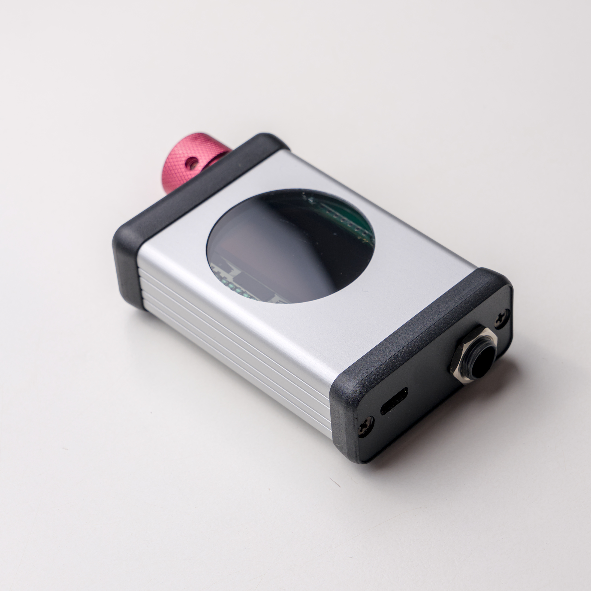
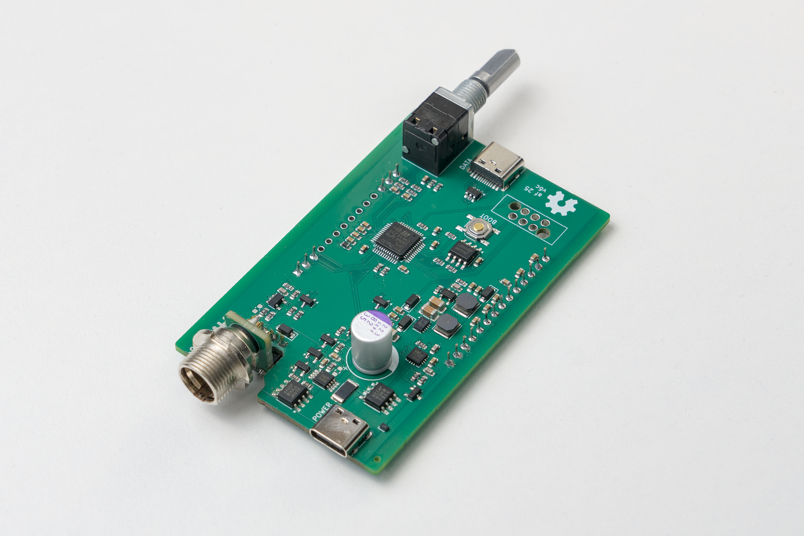
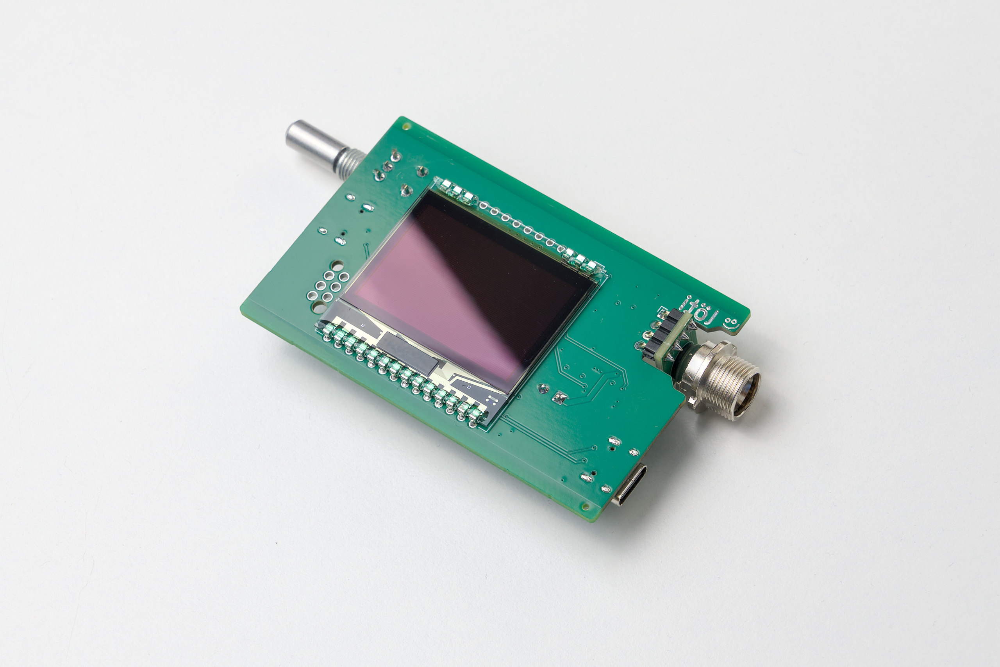

# Löti

Soldering station hardware and firmware, powered by USB PD, delivering up to 100 W.

Supports irons with thermocouples as temperature probes, for example
- JBC C210
- JBC C245

## Resources

- [Hardware design](./hardware)
- [Firmware](./firmware)

## The finished product

